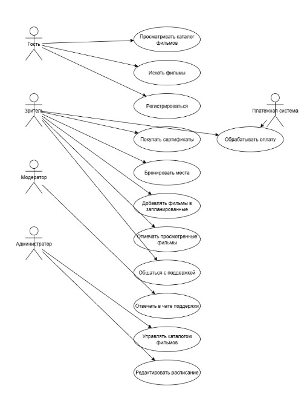
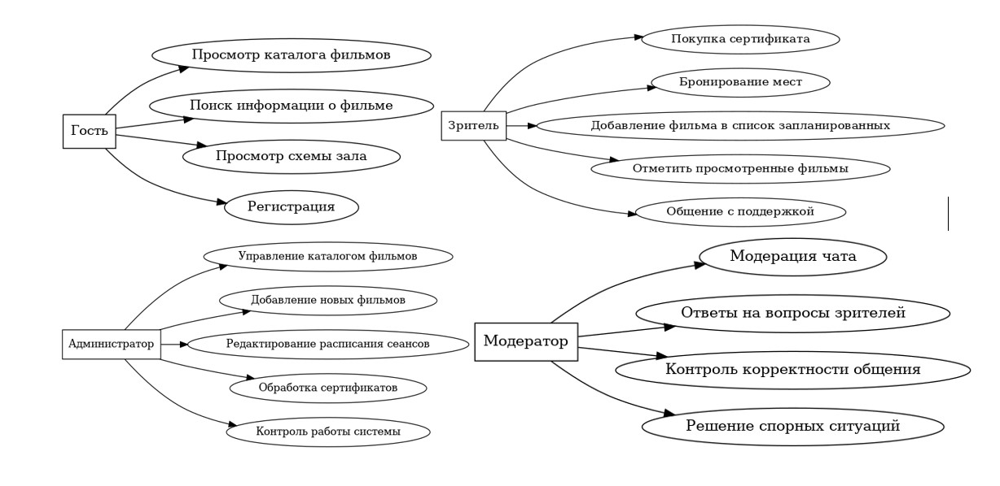
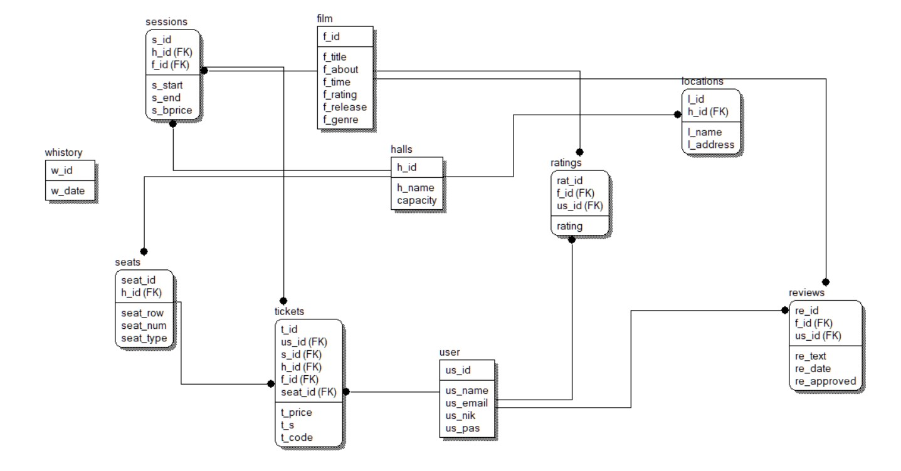

# Sunlight Cinema - Backend

## Описание проекта
Backend-часть веб-сервиса для бронирования билетов в сеть кинотеатров Sunlight cinema.

##  Стек используемых технологий
- **Backend**: Java 17+, Spring Boot 3.+
- **База данных**: PostgreSQL
- **Тестирование**: JUnit5

##  Роли пользователей и варианты использования

### 1.  Гость (Неавторизованный пользователь)
- Просмотр афиши и расписания сеансов
- Просмотр схем залов
- Покупка билетов без регистрации
- Чтение отзывов и рецензий
- Регистрация в системе
- Просмотр информации о кинотеатрах

### 2.  Авторизованный пользователь
- Вход в аккаунт
- Бронирование мест на сеансы
- Покупка сертификатов
- Оставление отзывов и оценок к фильмам
- Оценка полезности чужих отзывов
- Просмотр накопительной скидки
- Получение эксклюзивных акций
- Управление списками: "Просмотренные" и "Запланированные"
- Общение в чате поддержки

### 3.  Модератор
- Модерация новых отзывов
- Одобрение/отклонение отзывов
- Ответы на отзывы пользователей
- Поддержка в онлайн-чате

### 4.  Администратор
- Управление кинотеатрами и залами
- Управление расписанием сеансов
- Управление базой фильмов
- Настройка эксклюзивных акций
- Контроль работы системы
- Обработка сертификатов





##  Схема БД - ER диаграмма


##  API

###  Аутентификация и пользователи

| Метод | URL | Описание | Роль |
|-------|-----|-----------|------|
| POST | `/api/auth/register` | Регистрация | Гость |
| POST | `/api/auth/login` | Вход в систему | Все |
| GET | `/api/users/profile` | Профиль пользователя | Зритель |
| GET | `/api/users/watch-history` | История просмотров | Зритель |
| GET | `/api/users/watchlist` | Список запланированных | Зритель |

###  Фильмы и сеансы

| Метод | URL | Описание | Роль |
|-------|-----|-----------|------|
| GET | `/api/films` | Каталог фильмов | Все |
| GET | `/api/films/{fid}` | Детали фильма | Все |
| GET | `/api/sessions` | Расписание сеансов | Все |
| GET | `/api/sessions/{s_id}/seats` | Свободные места | Все |
| POST | `/api/admin/films` | Добавить фильм | Админ |
| PUT | `/api/admin/sessions/{s_id}` | Обновить сеанс | Админ |

###  Бронирование билетов

| Метод | URL | Описание | Роль |
|-------|-----|-----------|------|
| POST | `/api/tickets/reserve` | Забронировать места | Зритель |
| POST | `/api/tickets/confirm` | Подтвердить бронь | Зритель |
| GET | `/api/tickets/{tcode}` | Информация о билете | Зритель |
| GET | `/api/users/tickets` | Мои билеты | Зритель |

###  Сертификаты

| Метод | URL | Описание | Роль |
|-------|-----|-----------|------|
| GET | `/api/certificates` | Доступные сертификаты | Все |
| POST | `/api/certificates/purchase` | Покупка сертификата | Зритель |
| GET | `/api/users/certificates` | Мои сертификаты | Зритель |
| POST | `/api/admin/certificates` | Создать сертификат | Админ |

###  Чат поддержки

| Метод | URL | Описание | Роль |
|-------|-----|-----------|------|
| GET | `/api/support/conversations` | Список диалогов | Зритель/Модератор |
| POST | `/api/support/conversations` | Начать диалог | Зритель |
| GET | `/api/support/conversations/{id}/messages` | Сообщения диалога | Зритель/Модератор |
| POST | `/api/support/messages` | Отправить сообщение | Зритель/Модератор |

###  Управление списками фильмов

| Метод | URL | Описание | Роль |
|-------|-----|-----------|------|
| POST | `/api/users/watchlist/{fid}` | Добавить в запланированные | Зритель |
| DELETE | `/api/users/watchlist/{fid}` | Удалить из запланированных | Зритель |
| POST | `/api/users/watched/{fid}` | Отметить как просмотренный | Зритель |


## 📘 Swagger API документация

Проект использует [Swagger UI](https://swagger.io/tools/swagger-ui/) для автоматической генерации документации REST API.

### 🔧 Как запустить Swagger UI

1. Проект собран и запущен (`mvn spring-boot:run` или через IDE).
2. Перейдите по адресу: [http://localhost:8080/swagger-ui/index.html](http://localhost:8080/swagger-ui/index.html)

### 📂 Структура API

- Все эндпоинты находятся в пакетах `com.sunlight_cinema.sunlight_cinema.controller`
- Методы аннотированы `@Operation`, `@Parameter`, `@ApiResponse` для расширенного описания

### 📤 Экспорт схемы OpenAPI

Для получения схемы в формате JSON или YAML:

- JSON: [http://localhost:8080/v3/api-docs](http://localhost:8080/v3/api-docs)
- YAML: [http://localhost:8080/v3/api-docs.yaml](http://localhost:8080/v3/api-docs.yaml)

### 📦 Пример использования схемы

Схему можно использовать для генерации клиента, например с помощью [OpenAPI Generator](https://openapi-generator.tech/):

```bash
openapi-generator-cli generate \
  -i http://localhost:8080/v3/api-docs \
  -g java \
  -o ./generated-client
